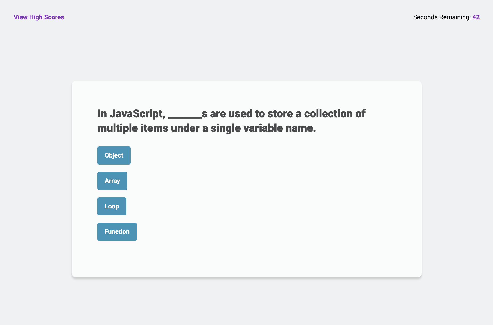

# javascript-quiz

Javascript Quiz is an application for testing the users knowledge of basic JavaScript and allows them to compare their score to others that have taken the quiz on the same machine.

## Installation

No Packages to install

## Usage

The number of quiz questions is set to be dynamic to the number of objects in the quizCards array. Adding and removing questions will update throughout the app.

## Contributing

Cloning the repo is welcome. Do not push new code into the repo without creating a pull request.

## License

No license on this repo

## Assets

Link to delpoyed application https://jsgunn22.github.io/javascript-quiz/

